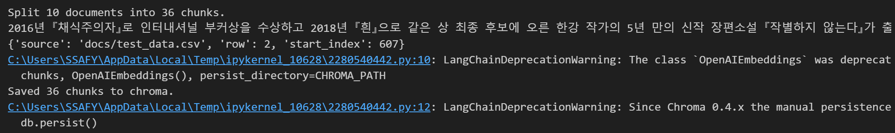
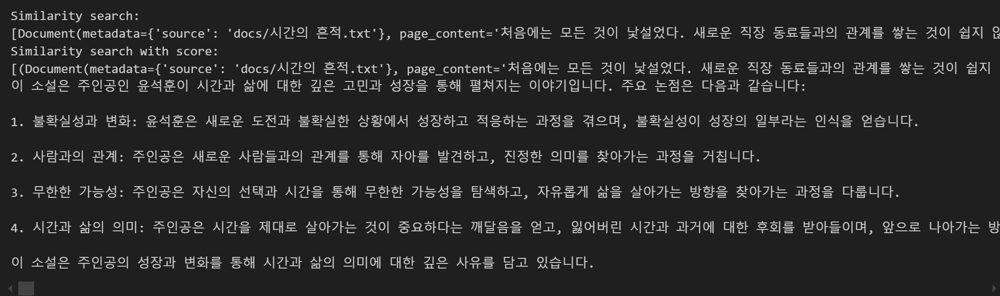

# 1주차 학습내용
1. AI
    
    1. RAG 복습
    - 수집한 데이터(도서 관련)이 RAG에 얼마나 효과가 있는지 확인하기 위해 테스트트 기능을 구현.
        - txt, csv 파일을 기반으로 RAG를 테스트해볼 수 있음
        
        
    - 이미지 생성을 위한 기술에 대해 학습중 (diffusion model 등)

2. Infra

    1. docker 복습
    - 현재 확정된 backend, frontend 환경을 구성하기 위해 docker container를 구성

    - docker-compose를 기반으로 한 번에 빌드 및 실행이 가능

    - 아직 React 환경에서 테스트 파일이 정상적으로 실행되지 않아 debug가 필요해 이 부분에 대해 집중적으로 학습중

    2. CI/CD 학습
    - Jenkins에 대해 공부하면서 자동화 pipeline을 구성하고자 하였고 학습하였음
        - GitLab과의 연동을 완료했고, push test를 했을 때 정상적으로 jenkins가 작동하는 것을 확인

    - 하지만 구현 난이도 측면이나 현재 상황에서 GitLab CI/CD를 기반으로 구축하는 것이 낫다고 판단하여 이를 활용한 pipeline 구성을 학습 중
    
    - AWS를 서버로 사용할 예정이라 구현하려는 pipeline에 AWS를 바로 넣어 구축할 수 있는 방식으로 학습중