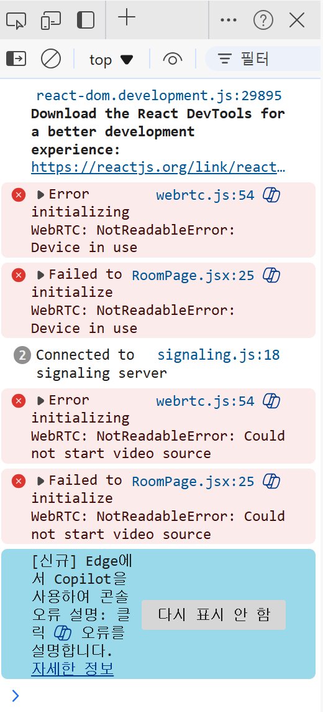
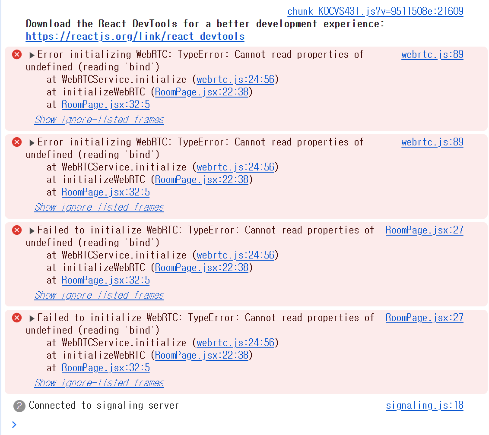

# 1주차 학습내용

- BE
    -
    - 회원 가입 기능 구현
    - 로그인, 로그아웃 기능 구현
    - 로그인 정보 JWT토큰 쿠키에 저장하여 전달

- WebRTC
    - 
    - WebRTC 예제 [블로그](https://dev.to/wassafshahzad/building-real-time-communication-harnessing-webrtc-with-fastapi-part-1-ael)를 참고하여 코드 분석 및 실습
    - 수많은 error 발생
    
    

    - stun/turn 서버의 문제인가 싶어 통신에 대한 학습 필요
- Data
    -
    - 책 리뷰 사이트의 리뷰들 크롤링 시도
    - 알라딘, 카카오등 API 테스트