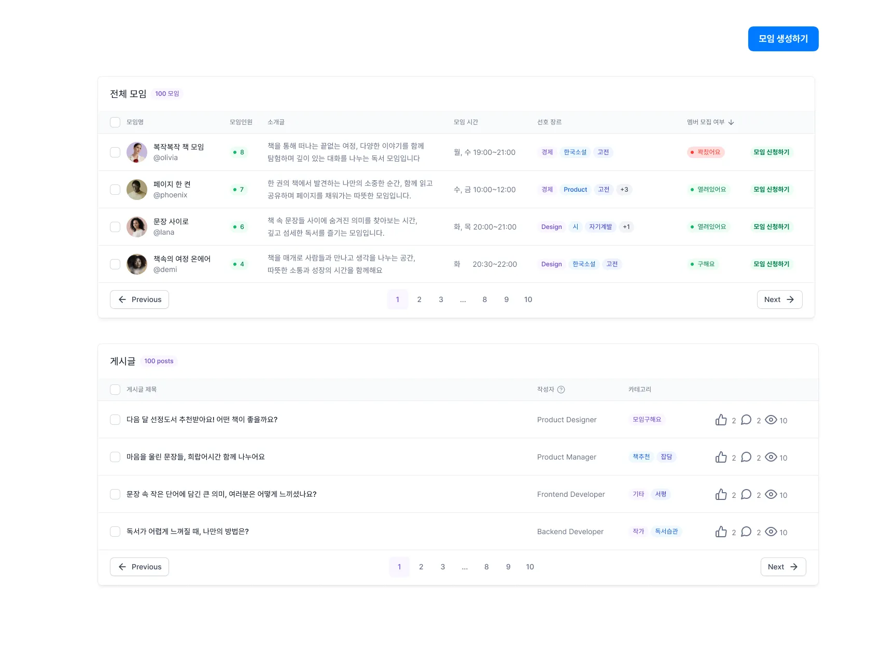
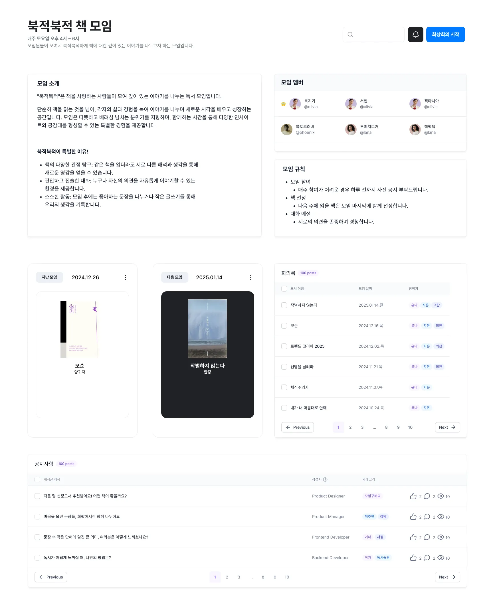
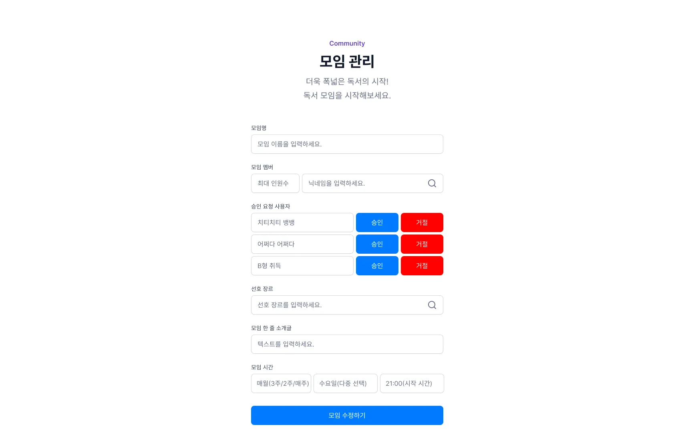
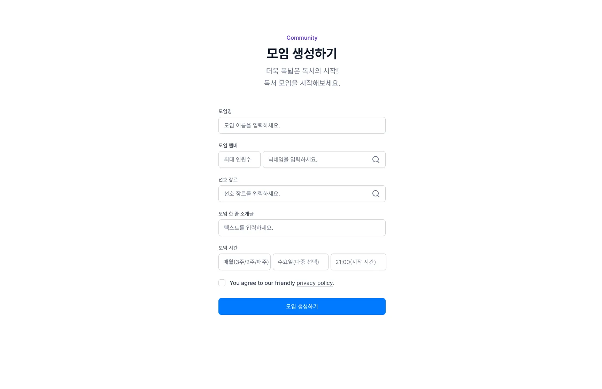
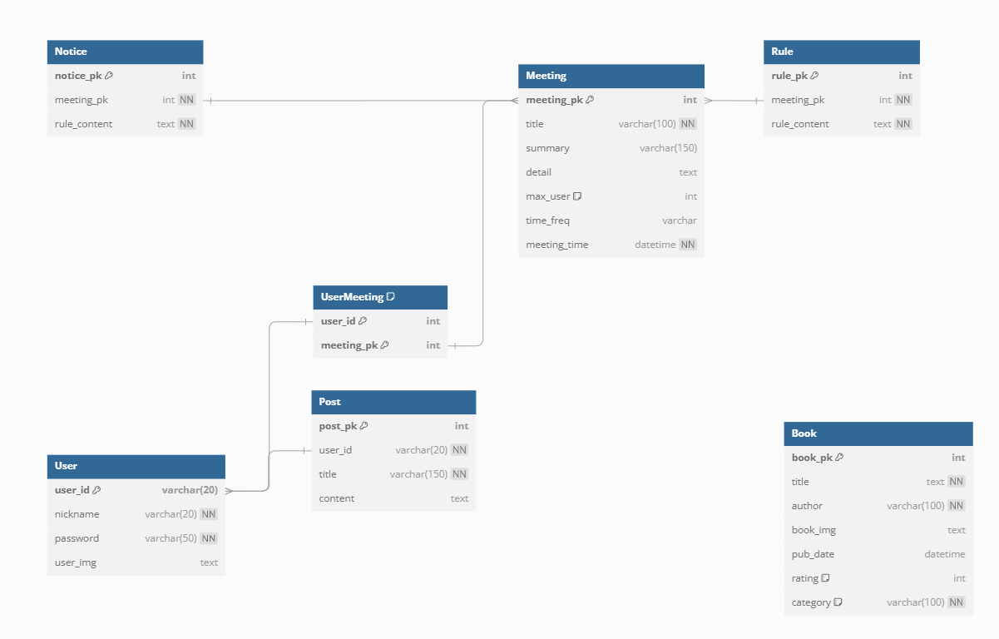
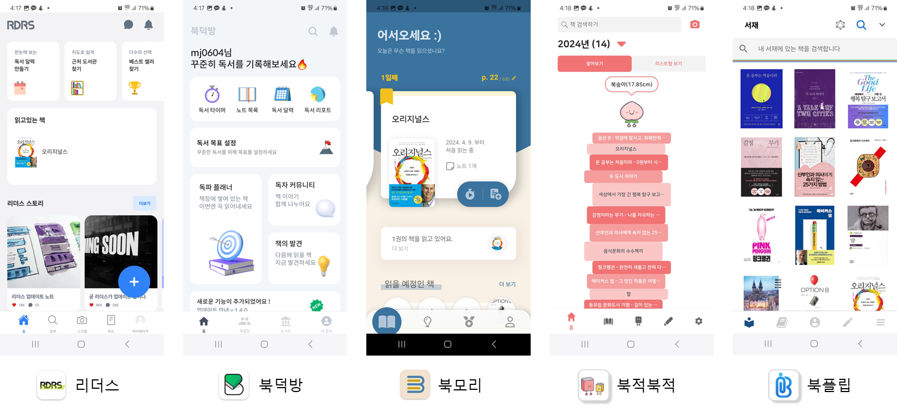
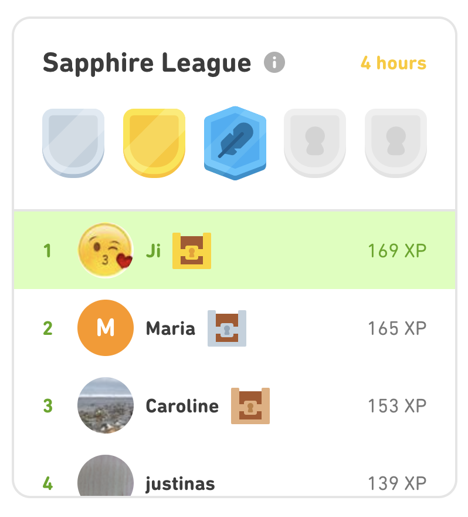

# 1주차 학습내용

## 백엔드에서 사용할 기능 공부

### FAST API

Fast API 공식 문서를 보고 따라해보았음. 로컬에 코드로 작성해두었기 때문에 전부 복사가 어려워 공식문서 링크만 남김. 
https://fastapi.tiangolo.com/

### Web RTC 기본 개념 및 문서 보고 따라해보기 
아직 따라해보는 중. 이번주 중으로 완성할 듯 함.
https://forest71.tistory.com/211

공식문서 : Mozila & RTC 문서

## 프로젝트 업데이트

### 컨셉 확정 및 피그마 
Front에선 WebRTC, AI에선 Reg 를 테스트 하는 동안 Back에선 컨셉과 무관하게 독서모임 시스템에서 반드시 필요한 기능들을 정리하고 이를 피그마로 업데이트 및 필요 기능을 논의 및 정리하고, 이를 피그마와 ERD로 만들었습니다.
* 메인 페이지
 
* 게시글 detail 
 
* 모임 관리 페이지
 
* 모임 생성 페이지
 

### 데이터베이스 테이블 및 변수 이름 지정, ERD(컨셉 변경으로 금요일 변경될 예정)
- **User**

| 데이터 | 변수이름 | reference | 타입 |
| --- | --- | --- | --- |
| 유저아이디 | user_pk | autoincrement | INT |
| 닉네임 | nickname |  | VARCHAR |
| 비밀번호 | password | 8~12자 이내, 영문과 특수문자가 섞여야 함.  | VARCHAR |
| 이미지 | user_img | Static URL | TEXT |
| 신고 | report | 신고 당했는지 여부 | BOOL |
- **Book**

| 데이터 | 변수이름 | reference | 타입 |
| --- | --- | --- | --- |
| pk | book_pk |  | INTEGER |
| 책 이름 | title |  | VARCHAR |
| 작가 | author |  | VARCHAR |
| 책 이미지 | book_img |  | VARVHAR(255) |
| 출간일 | pub_date |  | DATETIME |
| 리뷰평점 | rating |  | INTEGER |
| 카테고리 | category | 추후 변경 예정 | VARCHAR |
- UserBook : User와 Book을 합친 형태]
    - 읽은 날짜
- **BookClub**(추후 변경 예정. 특히 WebRtc 기능 추가되면 많이 달라질 수 있을듯 ㅠ.)

| 데이터 | 변수이름 | reference | 타입 |
| --- | --- | --- | --- |
| 미팅 pk | meeting_pk |  | INT |
| 방 제목 | title |  | VARCHAR(100) |
| 방 1줄 소개 | summary |  | VARCHAR(150) |
| 모임 상세 소개 | detail |  | TEXT |
| Max 인원수 | max_user | 디폴트 6명, 진짜 max값은 6명 | INT |
| 모임주기 | time_freq | “{주기}에 {int}번, {요일}”
ex) 1달에 2번, 월 수 | VARCHAR |
| 모임시간 | time | ex) 17:50, 모임 시작 시 | DATETIME |
- **Notice(모임 공지사항)**

| 데이터 | 변수이름 | reference | 타입 |
| --- | --- | --- | --- |
| meetingpk | meeting_pk |  | INT |
| 공지 번호 | notice_pk |  | INT |
| 공지 내용 |  notice_conttent |  | TEXT |
- **Rule(모임 Rule)**

| 데이터 | 변수이름 | reference | 타입 |
| --- | --- | --- | --- |
| meetingpk | meeting_pk |  | INT |
| Rule 번호 | rule_pk |  | INT |
| Rule 내용 | rule_content |  | TEXT |

- **UserClub**(User별로 어떤 Club에 속해있는지 확인하는 용도. User가 여러개의 모임을 가입할 수 있어서 분리해둠.)

| 데이터 | 변수이름 | reference | 타입 |
| --- | --- | --- | --- |
| userid | user_pk |  | INT |
| meetingpk | meeting_pk |  | INT |
- **Post (커뮤니티에 올린 글)**

| 데이터 | 변수이름 | reference | 타입 |
| --- | --- | --- | --- |
| postpk | post_pk |  | INT |
| 작성자 | user_pk | user_pk값임 | INT |
| 제목 | title | 150자 이내 | VARCHAR(150) |
| 내용 | content |  | TEXT |

- **회의록(notes)**

| 데이터 | 변수 이름 | reference | 타입 |
| --- | --- | --- | --- |
| 회의록 pk | note_pk |  | Int |
| 모임 pk | book_club_pk | 모임 회의록 확인 | Int |
| 발화 시간 | 발화시간 |  | Datetime |
| 발화한 사람  | user_pk |  | Text |
- **Conference**

| 데이터 | 변수 이름  | reference | 타입 |
| --- | --- | --- | --- |
| 컨퍼런스 pk | Conference_pk |  | Int |
| 컨퍼런스 오너  | Owner_id |  | Int |
| 컨퍼런스 시작 | Call_start_time |  | datetime |
| 컨퍼런스 끝  | Call_end_time |  | datetime |
| 썸네일 | thumbnail |  | Text |
| 제목  | Title |  | Varchar(100) |
| 컨퍼런스 설명 | description |  | text |
- **ConferenceHistory**

| 데이터 | 변수 이름  | reference | 타입 |
| --- | --- | --- | --- |
| 히스토리 pk | Conference_history_pk |  | INT |
| 책 pk 값 | Book_pk |  | INT |
| 컨퍼런스 pk | Conference_pk |  | INT |

https://yeongunheo.tistory.com/entry/DB-%EC%84%A4%EA%B3%84%ED%95%98%EB%8A%94-%EB%B2%95-feat-%EB%8D%B0%EC%9D%B4%ED%84%B0-%EB%AA%A8%EB%8D%B8%EB%A7%81

* ERD : 진행 중에 컨셉이 엎어져서 미완성인 상태
 

### 기본적인 CRUD 구현 및 데이터베이스 연결 
* 로그인은 세션이 아닌 쿠키에 저장했으며, 추후 프론트에서 세션에 저장할 예정.
* 소셜 로그인은 미정이어서 해당 사이트를 보고 흐름만 파악 중

## 아이디어 모음

* 독서 모임 후기 검색
    - 결과적으로 제일 힘든 부분은 사람 모으기이다. 따라서 사람을 모을 수 있는 시스템이 제일 중요한것 아닐까?
        * https://brunch.co.kr/@hati/21
        * https://brunch.co.kr/@jjacksarang/158
    - 사람을 모을 수 있는 시스템 : 
        * 랜덤으로 모으기
        * 조건 검색(성별, 횟수, 좋아하는 책)
        * 번개 모임(전체 챗처럼)

* 독서 앱 사용 및 차별점 아이디어 생각

- 게이밍 시스템 도입해서 책을 읽으면 책 높이만큼 유사한 높이의 물건을 스탬프로 제공(사람 평균 키의 1.5배 등)
    * 장점 : 귀여운 것을 수집하기 좋아하는 사람들에게 Gaming 시스템을 도입 가능
    * 단점 : 유사한 시스템이 북적북적 앱에 있음. 

- 달력 시스템과 유사한 앱 : 
    * 왓챠피디아 - 강사님 추천
    * 모임이 너무 멀리 떨어진 경우 달력에 업데이트 되는 책이 너무 적음 
- 책을 읽었는지 확인하는 방법 :
    * 책을 찍어서 텍스트 확인 - Full 텍스트가 있어야 확인 가능,저작권
    * 유저끼리 확인(좋아요 시스템)
        - 유저끼리 확인해서 좀 이상하면 신고하거나, 삭제 요청
        - 좋은 회고록인 경우 책 표지 선물, 책장에는 해당 책 표지가 쌓임.
        - 이런식으로 게이밍 리워드시스템으로 확인
        - 
    * 확인하지 않는다. 
        - 꼭 확인해야 할까? 모든 앱들이 이런걸 확인할 수 없어서 그냥 내버려둔다. 그러고도 정상 운영이 된다. 
    * 책 퀴즈로 확인 : 
        - 이걸 누가 내며, Ffull text필요

- 유사도를 기반으로 책 추천 - Full text 대신 리뷰로 추천 : 
    * 리뷰나 회고록의 정보 오염이 문제가 된다면, 이를 GPT로 책에 대한 내용만 뽑아낸다.-> 오염도를 줄일 수 있음.
    * 아니면 어둠의 경로로...? 
    * 사람들이 좋아하는 책들만 추천해준다면 가능할 것 같다. 
        * 영화 추천 시스템과 유사하게- 많이 따봉을 받은 순서대로 

- 회고록을 쓸 경우 참고할 앱 : 
    * 마이 다이어리
    * 다이어리 배경- 카카오페이지 배경
    * 이 시스템에 딱히 매력을 못느껴서 잘 모르겠다. 다이어리 앱을 열심히 찾아보았으나 딱히? 

- 텍스트 힙- 자랑 시스템 구현
    * 텍스트 일부를 배경 넣어서 자랑할 수 있는 이미지로 변환 
        - 단점 : 해당 책에 대한 텍스트인지 어떻게 알지? - 굳이 알아야 하나?/ 이걸 하고 싶을까? 최소한 나는 아니다.
        - 장점 : 쩻든 SNS에 자랑은 가능하다.
    * 수집 시스템 : 
        - 결국 지난번에 만든 게이밍 시스템과 유사하다. 
        - 방탈출 게임 앱과 같은 이미지면 좋을 것 같다. 
        

- 게이밍 시스템 구체화
    * 듀오링고 시스템 확인. - Solved AC처럼 하자고 하는데 조금 detail해서 덜 하면 좋을 듯 하다. 
    

- 독서하도록 재촉 : 듀오링고?
    * 장점 : 재촉이 가능하다. 그리고 농담 코드만 맞다면 앱의 메시지를 보는 재미도 있을 듯 하다. 
    * 단점 : 학습앱인가...? 

- 다른 아이디어 : 
    * 채팅으로 단체 바둑 두기 
        * 10초를 주고 이 시간 안에 사람들이 가장 많이 선택한 위치에 바둑돌을 놓음 
        * 패자는 다음 게임으로 못넘어가고, 남은 사람들끼리 반을 갈라서 대국을 함.
        * https://store.steampowered.com/app/359960/Choice_Chamber/?l=koreana&curator_clanid=6267400
    * 숨고처럼 간단하게 알바처럼 할 수 있으면서, 온라인으로 일을 처리하고 싶은 사람들을 위한 서비스. 
        1. 만남이 아니고 실시간 온라인으로 대화하고 싶은 사람들은 ‘온라인 미팅’ 탭에서 고객 혹은 서비스 제공자를 찾는다. 
        2. 비용은 시간당으로 계산하고, 시간 * 비용으로 계산하여 총 비용 계산하여 입금
        3. 연락처를 주기 싫은 경우 실시간 채팅 가능하도록 서비스 제공
    * 요양원에서 지루하게 지내는 어르신 분들에게 즐거움을 주기 위하여, 자원봉사자들이 시간을 예약하면 해당 시간에 요양원 노인 분들에게 재롱잔치 제공…
        1. 자원봉사 등록 
        2. 어떤 종류의 즐거움(마술, 연극, 노래 등) 을 제공 가능한지 등록함. 
        3. 사람들이 많이 신청한 자원봉사자는 상단에 뜨도록 함.
    * 자동 자동화 기획 서비스
        - 기획 의도 : 공장 작업자들 중 나이가 많거나 IT 인력 부족으로 해당 자동화를 이루어주기 힘든 경우 자체적인 사무 자동화를 해당 서비스가 제작하여 제공해줌.
        - 방법 :
            - 스피커를 켜두면 직원들이 불편했던 업무들에 대한 내용들을 음성으로 입력한다.
            - 해당 내용을 듣고 바로 사무 자동화를 작업해준다. 필요한 내용들은 AI가 요청한다.
            - 필요시 파일 업로드를 할 수 있도록 만든다.
            - 산출물은 .exe 파일, 혹은 자동화된 엑셀 파일이면 좋을 듯 하다.
        - Claude와의 차별점 :
            - 한국어로 서비스를 제공하며, 굳이 코드로 보여주는 것이 아니라 결과물로서 제공한다. 에러가 뜨는 경우 자체적으로 해결해줄 필요가 있다.
            - 에러가 일어나는 경우 시도 가능한 몇가지 경우에 대해서 알려줄 수 있어야 한다

    * 아이 감시 서비스
        - 눈동자를 보고 집중 중인지 혹은 딴짓 중인지 확인한다.
        - 공부한 시간, 자리에 없었던 시간 등 실시간 감시 서비스를 제공한다.

    * 영상 미팅 회의록 정리
        - 해당 미팅과 관련된 모든 이메일을 다 읽어서 필요한 내용을 다 정리해서 보여줌
            - issue history, background, 각 부서 입장 등
        - 해당 미팅과 관련된 다른 미팅이 있는 경우, 해당 내용과 비교해서 같이 정리해서 줌.
            - ex) 동일 issue에 대한 Engr’ & QA 미팅
        - 기존 업무 기록들 중 유사한 문제가 있었다면 해당 내용을 정리해서 보여주며, 담당자를 정리해서 알려줌.
        - 회의 중간에 의견과 유사한 문제가 있었는지 실시간으로 대화 파악하여 이메일/문서 검색하여 알려줌.
        - 문제에 대한 해결책을 낼 때 고객 성향/상황을 미리 알려주어 어떤 답변을 원할지(빠른 해결을 원하는지, 혹은 완벽하게 해결되기 전까지 계속 물고 늘어지는지 등) 제안을 줌.
        - 솔루션이 공장 SPEC 과 다른 경우 이를 알려준다.
        - 또한 고객에게 이미 기존에 안내했던 SEPC, 혹은 Audit 시 알려주었던 스펙과 다르게 안내하는 경우 경고 문구를 띄워준다
        - industrial 기준 또한 입력하여 해당 내용과 부합하는지도 확인
    * Audit helper
        - 고객 감사 시 고객 성향에 따라 어떤 공정에서 어떤 문제를 짚어내는지 패턴 파악하여, 고객 오딧 전 준비 사항을 알려줌.
        - 내부 SPEC, Work instruction, Special request, industrial 기준, 기존 audit finding등을 확인하여 해당 공정의 작업에서 확인이 필요한 사항을 알려줌
        - 감사 진행 중에 실시간으로 문제가 있을 법한 내용들, 해당 시스템의 헛점을 짚어서 해당 내용 확인하라고 알려줌.