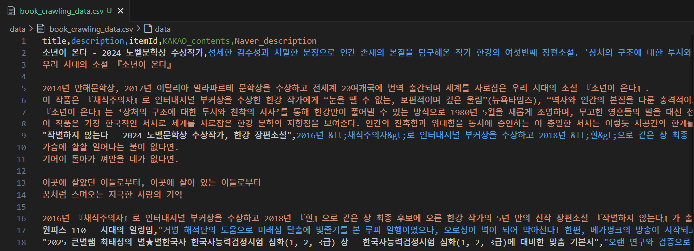
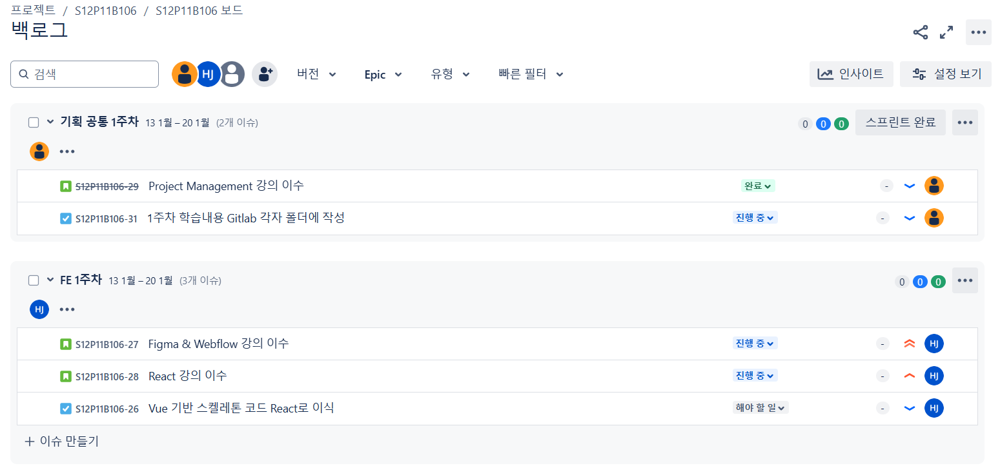
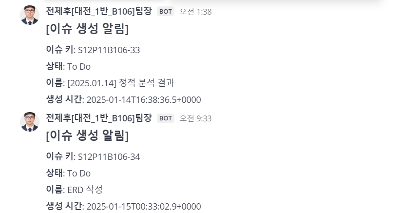
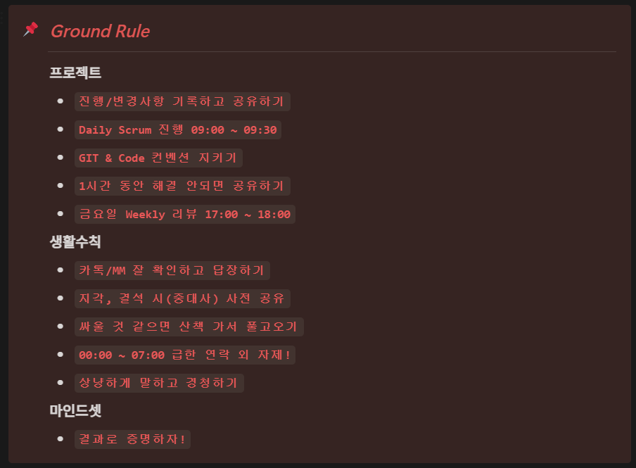
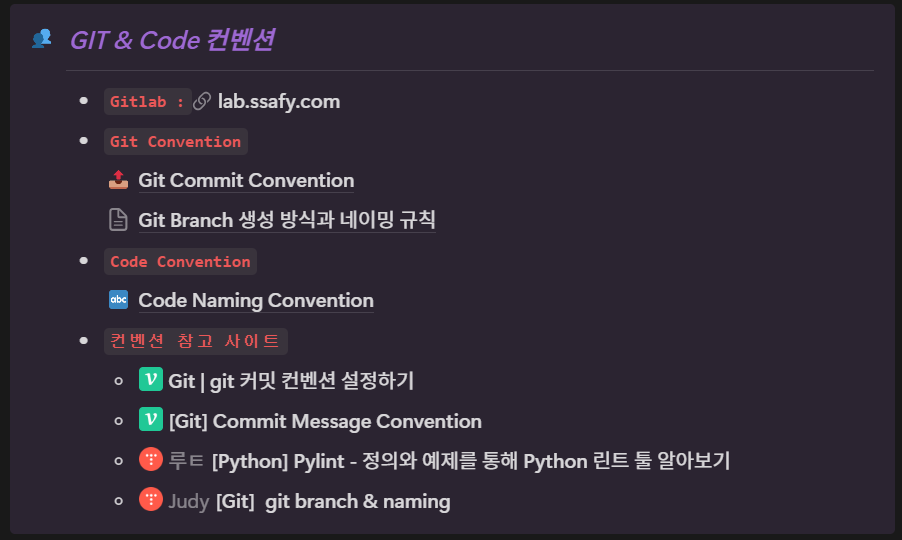
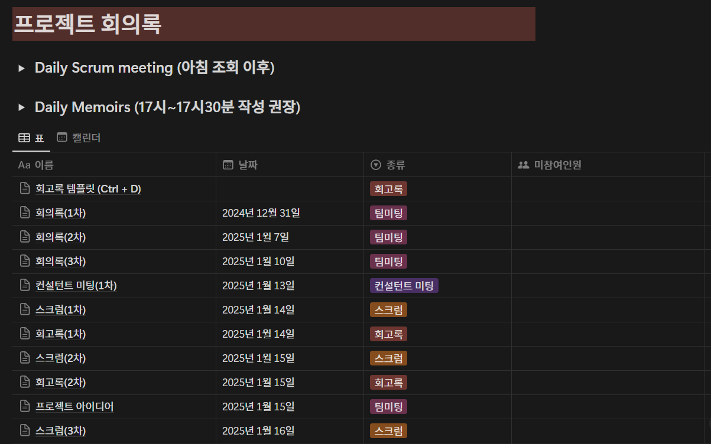
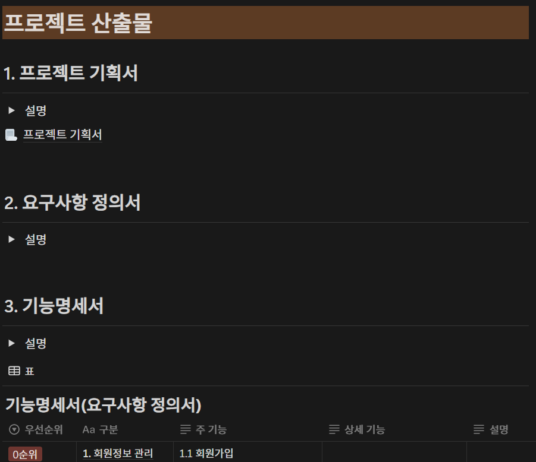

# 전제후[대전_1반_B106]팀장 PJT I 보고서

## 1. 프로젝트 개요
* 팀 이름: B106
* 프로젝트 주제: AI 기반 도서 생성 및 독서토론 서비스 (논의중)
* 담당 분야: DATA/AI, 팀장(PM)
* 담당 기술 스택: Python, Langchain

## 1주차 학습내용
### Crawling
* Aladin API를 활용하여 베스트셀러 도서에 대한 정보 수집 -> 모듈화
  * Aladin.py
* ISBN13 번호를 활용해 Kakao API, Naver API에서 도서에 대한 정보 수집 -> 모듈화
  * Kakao.py, Naver.py
* 수집한 정보를 DataFrame 형태로 변환하고, 병합하여 최종 전처리가 끝난 데이터를 DataFrame -> csv 파일로 data 폴더에 저장
  * Book_Crawling.py
* 최종 데이터 형태

* 추가적으로 책의 줄거리 관련하여 데이터를 수집하고자 하였으나, 저작권 문제로 인해 불가능 -> 주제 변경

### Jira
* 프로젝트 관리를 위해 SSAFY Git에서 Jira 생성
* 프로젝트 스프린트를 기획 공통, FE, BE, DATA/AI, Infra로 구분하여 생성 및 관리
  * 각 역할 담당자들이 이슈 생성하여 관리

* 스프린트에 이슈 생성 및 댓글이 달릴 때마다 Mattermost에 알림이 오도록 연동

* Gitlab에서 commit할 때 Jira 이슈번호 입력 시, 각 Jira 이슈에 연동되도록 설정

### Project Management 강의 수강
* 팀장의 역할 : 회의 진행, 일정 관리 등
* 상황에 따른 갈등관리 전략 Case Study 진행
  1. 문제해결/협력
  2. 강압/경쟁
  3. 회피/지연
  4. 수용/수습
  5. 타협/절충

### Notion 관리
* 각 멤버의 역할 및 MBTI, 다짐 등 개인신상 정보와 Ground Rule 정리

* GIT & Code 컨벤션, Branch 생성성 규칙을 설정하여 프로젝트 관리

* 프로젝트 회의록 및 스크럼, 회고록 등 기록을 저장

* 프로젝트 산출물 정리
